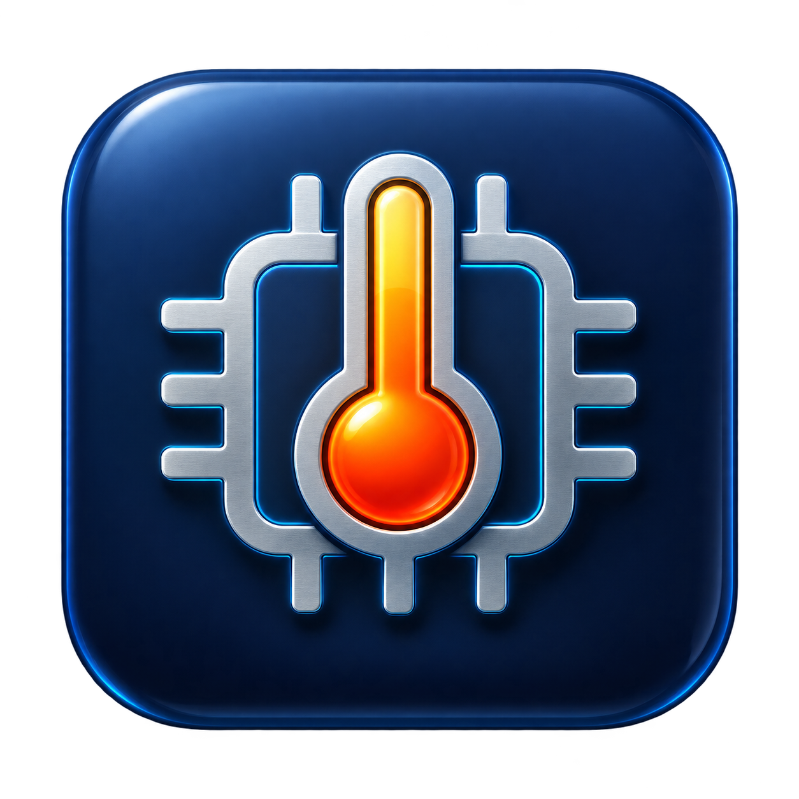

<p align="center"></p>

# Mac Temps

A small native macOS app for viewing live hardware temperature channels. Built with SwiftUI and a read-only AppleSMC client. No administrator password, network service, or third-party runtime is needed.

- Live readings every two seconds, with session peaks
- CPU, GPU, and battery summaries using mapped channels
- Search by sensor name, ID, group, or mapping status
- Celsius and Fahrenheit display
- CSV export of readings and mapping status
- Honest labels for community-mapped, tentative, disputed, and unknown channels

## Build and run

Requires macOS 14 or later and Apple's Xcode Command Line Tools (`xcode-select --install`). Tested on a 16-inch M1 Max MacBook Pro, model `MacBookPro18,2`. The sensor-name catalog is scoped to that model; other Macs retain unknown names and may expose different or unsupported channels.

```sh
./build.sh
open "Mac Temps.app"
```

To install, copy `Mac Temps.app` into your Applications folder. The local build uses ad-hoc code signing; it is not a notarized distribution.

To run the diagnostic reader:

```sh
xcrun swiftc SensorCatalog.swift Sensors.swift probe.swift -o probe -framework IOKit
./probe
```

## Understanding readings

The test machine exposes 238 temperature channels, typically 220 with valid readings. Channels may represent derived values, aggregates, or inactive entries rather than separate physical sensors. The app displays a dash for unavailable readings or values outside the accepted range of 0–150°C. Peaks reset when the app restarts.

Sensor names are community research, not an Apple specification. Hover a sensor for its evidence. Tentative, disputed, and unknown channels never contribute to the headline summaries. See [sensor research notes](SENSOR-NOTES.md).

The app only reads SMC data; it does not change fan speeds or thermal controls.

## Attribution and license

Distributed under GPL-3.0-only; see [LICENSE](LICENSE). The sensor catalog includes descriptions derived from [iSMC](https://github.com/dkorunic/iSMC) (GPL-3.0) and [Stats](https://github.com/exelban/stats) (MIT). Their license notices are retained in [ThirdParty](ThirdParty). Sensor references and limitations are recorded in [SENSOR-NOTES.md](SENSOR-NOTES.md).

The app icon was generated with OpenAI's built-in image generation tool. See [the icon prompt](Assets/ICON-PROMPT.md).
